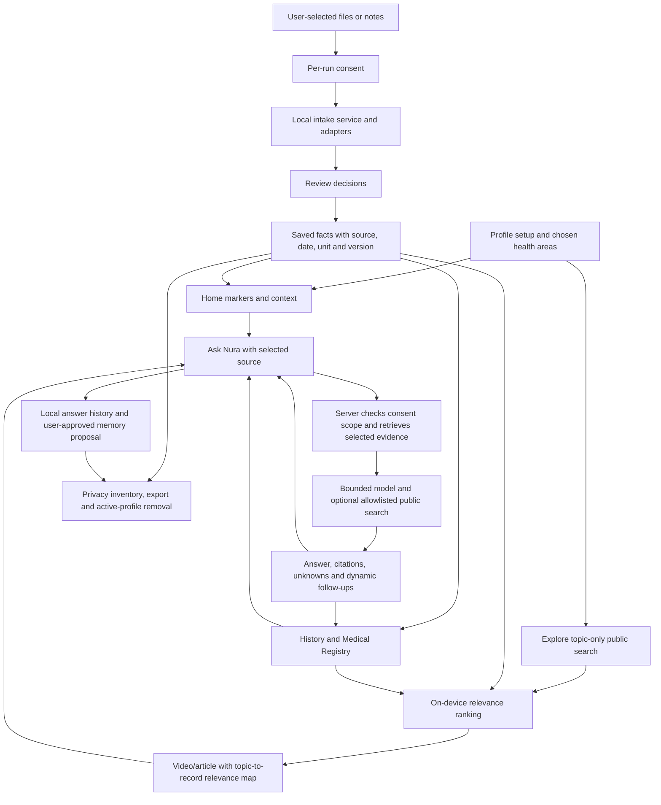

# Nura whole-build audit

**Latest verification — 5 October 2026 (full synthetic live-provider evaluation):** The current configured AI and discovery providers pass **16/16** scenarios: overall and five-turn stateful Ask, selected-video context, policy-grounded answers, urgent-symptom response, personalized source notes, health/policy PDF extraction, wrong-category holiday-document gating, health image/video extraction, consented audio transcription and attribution safety, trusted public-source search, playable Explore videos/thumbnails, and YouTube discovery. The run used generated synthetic records, reports and speech; no user health data was sent. The separate current connected reduced-motion browser rehearsal passes **121/121**, and the full repository suite passes **561/561** with typecheck, lint and diff checks green. The browser model was intercepted locally; live-provider checks establish a functioning configured integration, not clinical validation, production operations, supported-native-device acceptance, or the remaining identity/privacy/security release gates. Whole-build acceptance remains **0/11 stories, 0/8 production gates, 0/19 packages**.

**Latest verification — 5 October 2026 (insurer reply capture and connected browser run):** The reduced-motion `npm run test:m1-ask-browser` rehearsal passes **122/122** with temporary synthetic profile/files and intercepted model responses. It additionally verifies that a recorded insurer reply is labeled user-reported, linked to the exact accepted policy claim, excluded from AI requests, editable across reload, and removable without changing policy wording. The rest of the journey covers setup, intake/review, marker ranges, registry conflicts, Explore, policy comparisons, consent cancellation, cited Ask answers, titled conversation history/linking, Registry summary freshness, selected-video multi-turn context, privacy export/deletion, care, connections, sign-out/revocation and recovery. Outbound provider traffic was blocked; external requests were limited to public YouTube thumbnail URLs containing video IDs. The full repository suite passes **561/561**; typecheck, no-cache lint and diff checks pass. This remains connected synthetic web evidence, not live clinical answer quality, native-device behavior, production account isolation or whole-product acceptance. Overall acceptance remains **0/11 stories, 0/8 production gates, 0/19 packages**.

**Latest verification — 5 October 2026 (wrong-category and fresh-video live checks):** Added a generated holiday-itinerary scenario to the live evaluation. With the insurance category selected, the configured AI provider classified the document as `travel_document`; the purpose gate required user confirmation and released **zero policy claims**. The synthetic wrong-document check passes **1/1**, and the existing synthetic medical/insurance PDF extraction checks pass **2/2**. Focused category-gating, delete-source, Explore deduplication, YouTube replacement-pool, local Ask-context ranking and consent tests pass **50/50** (the two localhost integration cases require permission to bind a local port; rerun with that permission passed). A live public YouTube repeat check returned **10** initial videos and **10** replacement videos with **0** overlap and **10** usable thumbnails. Recent Ask cues still rank results on-device; sending those cues to public search remains blocked pending a separate explicit opt-in decision. These are targeted checks only; no interactive screenshot or full browser journey was run in this verification. Whole-build acceptance remains **0/11 stories, 0/8 production gates, 0/19 packages**.

**Latest continuation — 5 October 2026 (insurance category confirmation and Explore review):** Ordinary document review now asks the existing extraction request to classify each document segment from its content. If the selected category is contradicted or cannot be confirmed, candidate details are withheld and the source enters `purpose_confirmation_required`; the user can change to the detected health/policy category, explicitly continue under the selected category (which retries only after the normal consent step), or remove the file and its extracted source data. Insurance Registry no longer treats a filename/document label as proof of category or shows policy-term suggestions while confirmation is required. This adds no separate provider request. Explore source summaries now retain up to 2,000 characters and have a visible full-summary disclosure; its optional recent Ask context remains on-device and is visibly used to rank fresh topic-search results. Automatic query refinement by sending Ask cues to external search providers is **not implemented**: automatic approval rejected that payload, and it requires separate user opt-in authorization. Verification passes: repository suite **561/561**, TypeScript typecheck, no-cache Expo lint, the M1 synthetic intake integration, and `git diff --check`. No live-provider or screenshot evaluation was run. Whole-build acceptance remains **0/11 stories, 0/8 production gates, 0/19 packages**.

**Latest continuation — 5 October 2026 (HbA1c same-day review):** Medical Registry already groups dated HbA1c facts under one marker while preserving every source-linked record. Its same-day review now distinguishes unit-equivalent readings, unclear/incompatible units, and values that remain different after normalization. HbA1c `%` and `mmol/mol` are compared only through the official NGSP/IFCC master equation; an unclear `mmil` unit is routed to source confirmation instead of being called a numeric discrepancy. Tests cover equivalent, conflicting, and unclear-unit examples, including 5.9% versus 41 mmol/mol and the user-raised 5.7 `mmil` case. Original values and sources are never rewritten or merged. The shared conversion helper follows the official NGSP/IFCC master equation. Verification passes: marker-history suite **6/6**, health-marker suite, full repository suite **559/559**, TypeScript, no-cache Expo lint, and `git diff --check`. No provider request or health-data transfer was added. Whole-build acceptance remains **0/11 stories, 0/8 production gates, 0/19 packages**.

**Audit date:** 5 October 2026 · **Scope:** current Nura working tree compared with the build board, complete-build scope, story acceptance contract, experience design spec, mobile storyboards, agentic foundation, and delivery timeline.

**Latest continuation — 5 October 2026 (source-backed insurance extraction review):** The Insurance Registry now organizes already-extracted coverage terms into seven consistent areas: benefits, limits, member costs, exclusions/conditions, eligibility/waiting periods, dates/term, and claims/appeals. Each area is labeled identified, needs review, or not identified in this extraction; displayed evidence retains its exact quote and page. Missing extraction detail is explicitly not presented as an exclusion or proof the full policy lacks it. Verification passes: insurance snapshot suite **17/17**, full repository suite **555/555**, TypeScript, no-cache Expo lint, and `git diff --check`. This change uses the existing document review call and adds no provider transfer; no browser screenshot or live-provider check was run for the new card. The separate AI category pre-check remains unimplemented because automatic approval rejected the extra full-document classification transfer; it is waiting on explicit user authorization. Whole-build acceptance remains **0/11 stories, 0/8 production gates, 0/19 packages**.

**Latest continuation — 5 October 2026 (whole-repository cleanup):** The original accumulated changes are now reviewed and committed in feature-sized slices on `codex/m1-event-date-integrity`; the Nura checkout has a clean working tree. The slices cover structure/runtime, state, markers, Ask, intake/insurance, Explore/media, profile/setup/care, privacy/data lifecycle, and consent/session/audio service boundaries. The final `npm run test:repo` run passes **551/551**; `npm run test:audio-consent` passes **28/28**; TypeScript, no-cache Expo lint (zero errors and warnings), and `git diff --check` pass. All **123** repository test files are referenced by npm scripts. This cleanup pass did not rerun the browser journey or live-provider evaluation; the latest recorded results remain **121/121** and **15/15**, respectively, and are synthetic/demo evidence. Structural cleanup is complete; product acceptance remains **0/11 stories, 0/8 production gates, 0/19 packages**. Native-device behavior, production identity/isolation/storage, family profiles, provider operations, and independent clinical/privacy/security review remain open.

**Earlier continuation — 5 October 2026 (repository validation):** At that checkpoint `npm run test:repo` passed **545/545**; TypeScript, Expo lint, and `git diff --check` passed. The reduced-motion connected browser journey was **121/121** and the synthetic live-provider evaluation **15/15**. The checkout then had 289 changed paths. Those paths have since been reviewed and committed as described above. Strict acceptance remains **0/11 stories, 0/8 production gates, 0/19 packages**.

**Latest continuation — 5 October 2026 (canonical project and insurance file removal):** The Nura checkout is now opened as its own Codex project at `/Users/ashleyfernandez/Projects/NuraCodex`; `SingleIDContext` stays separate. Root agent instructions and the repository map document the canonical-root and change-slice workflow. Insurance users can now confirm deletion of a saved but unanalyzed local policy file; focused source-removal and document-purpose tests pass **11/11**, TypeScript and scoped lint pass, and `git diff --check` passes. Pre-extraction AI category checking is not implemented pending explicit authorization for the additional provider transfer of the selected insurance file. The screen-level removal interaction still needs a browser acceptance pass. Overall story and production-gate acceptance counts are unchanged.

**Earlier continuation — 5 October 2026:** Fresh reduced-motion synthetic browser acceptance passes **121/121**. It verifies range cards for all seven supported marker types using the shared approved palette, keeps unsupported ranges unclassified, and exercises both linked-chat consent paths: cancellation sends nothing; affirmative consent carries selected prior turns into a new conversation without merging histories. It also creates and cites a Registry summary, changes linked evidence, verifies stale prose is hidden, and confirms the explicitly expanded older summary is labeled. The wider Home → Health → Registry → Explore → Insurance → Ask → Care → Profile/Privacy journey and reload/zero-topic recovery also pass. `npm run test:repo` passes **507/507**; `npm run test:audio-consent` passes **28/28**. TypeScript passes. Full ESLint has **0 errors** and two unused-variable warnings in `server/agent/profileSummaryInsight.mjs`; the changed browser script and audio processor pass scoped lint. `git diff --check` passes. During that lint review, the FLAC/OGG transcription adapter was found to use `stat` and `readFile` without importing them; the imports are fixed and the audio suite now exercises the path. A fresh live-provider evaluation now passes **15/15** across health answers, multi-turn Ask, policy interpretation, media extraction, audio, trusted-source search and video thumbnails using generated synthetic records/files/speech. Two provider-connection failures from the earlier run passed targeted retries before the full rerun. These results establish synthetic journey and current provider-scenario behavior; they do not establish production uptime, native-device behavior or production readiness. Full-build acceptance remains **0/11 stories, 0/8 passed production gates, 0/19 accepted packages**; native-device, production identity/storage and independent governance gates remain open.

**Earlier continuation — 5 October 2026:** Home keeps the newest reading first and surfaces a saved cholesterol result in its first two cards; the full marker set remains available under the section control. The isolated reduced-motion browser rehearsal passed **94/94** at that checkpoint. It exercised scheduled and unscheduled visits, the explicitly selected source-linked brief, user-written questions, visit outcomes, dated follow-up completion, and reload recovery. Visit context passed **47/47** context tests. The captured 390 px Home view showed the cholesterol card, range band, date, and source. The then-current repository suite passed **506/506**; Expo Doctor passed **21/21**; iOS and Android JS bundle exports completed. A synthetic live-AI evaluation passed **15/15**, including a five-turn stateful health/video conversation. The dependency audit reported **23 vulnerabilities (3 moderate, 20 high)** after pinning the Xcode helper's `uuid` to patched **11.1.1**. Full-build status remains **0/11 accepted stories, 0/8 passed production gates, 0/19 accepted packages**; native-device, production identity/storage, and independent governance gates remain open.

**Live AI status, 4 October:** a later 14-path live-provider evaluation is recorded at the end of this audit and supersedes earlier statements below that live answers or YouTube results had not been verified. Whole-app production/story acceptance counts are unchanged.

**Latest verified continuation · 4 October 2026:** Ask broad-health answers now lead with supported findings in plain language: for example, total cholesterol of 7.9 mmol/L and LDL of 5.6 mmol/L are clearly called high against a common adult guide, while triglycerides of 1.4 mmol/L are described as within range. Same-date weight and height can add a BMI screening context; when age is unknown, adult-range wording is conditional and Nura asks for age rather than inferring it. Replies to clarification questions have a separate default-off per-run sharing choice and are not saved as profile facts. Implausible or conflicting units remain unclassified and prompt a report check. Insurance now offers a separate, user-selected side-by-side view for independent policy summaries, with source actions and an Ask Nura route; it does not imply replacement or active coverage. Focused Ask checks pass **65/65**; Insurance policy comparison checks pass **10/10**; the full synthetic repository suite passes **492/492**; Medical Registry stale-summary checks pass **12/12**; typecheck and `git diff --check` pass; ESLint reports 0 errors and 2 unused-symbol warnings in `app/ask.tsx`. The isolated browser rehearsal passes **105/105** with reduced motion. It uploads and reviews both synthetic policies, compares approved terms and source quotes, verifies missing-source wording and that comparison creates no replacement link, then checks the explicit Ask consent and cancel paths. Browser checks use fictional data and intercepted model calls; they do not establish live model quality, native behavior, or production readiness. Native device/restart/accessibility, live-provider answer quality, and production identity, storage, consent and deletion controls remain open.

## Executive read

Nura has substantial working foundations and several connected synthetic-demo journeys. It is **not yet a complete production app**. Strict acceptance remains **0/11 accepted user stories, 0/8 passed production gates, 0/19 packages**. That means no complete story or production gate has met every acceptance condition; it does not mean there is no implementation.

The strongest verified areas are local synthetic profile/intake/review, Home and Health markers, Explore-to-Ask, source-linked evidence, privacy export/removal foundations, and contextual follow-ups. The latest isolated synthetic browser journey passed **121/121** with reduced motion, covering profile/intake, multi-marker Health, source-cited Registry summary freshness, Ask/Explore/video, linked-chat consent, export/removal, sign-out, zero-topic re-entry and viewport checks. The full repository suite passes **507/507**, the audio-consent suite passes **28/28**, TypeScript passes, `git diff --check` passes, and ESLint has 0 errors with two unused-variable warnings in `server/agent/profileSummaryInsight.mjs`. These results establish local demo behavior only. Native device/restart and live-provider behavior remain unverified by this browser run. Family/caregiver profiles are not built; production identity, multi-person isolation, account storage/sync, privacy lifecycle, operations, clinical/privacy/legal review and release readiness remain open.

**Current implementation count:** 10 stories have partial foundations; M5 Ask is a connected demo slice; M10 family/caregiver profiles are not built. **Accepted count:** 0 stories. Acceptance requires the full mobile journey, persistence, provenance, failure handling and user-visible feedback.

**12-hour delivery boundary:** the requested 3 October 2026, 11:30 MYT target has passed. The local design/demo scope has been implemented and synthetically verified, including Home/Health markers, Explore video fallback and contextual relevance, Ask answer presentation and follow-ups, and a multi-screen browser rehearsal. That target was never sufficient for all 19 packages: native-device access, valid live-provider credentials, production identity/storage, and independent clinical/privacy/security review require external systems or reviewers.

## What exists now

### Decisions accepted in the design conversation and current fit

- **Home and Health markers:** Home shows the four newest distinct measurements by default as full-width stacked cards; the heading owns the `See all N ↓` expansion to the full set. Values, units, dates and source remain visible; range bands and color labels appear only for supported markers with compatible units. On Health, `LATEST MARKERS` sits directly under the Timeline/Connections tabs, ahead of the history summary and filters. The browser journey confirms an eligible cholesterol card and range band fit in the initial Health view; opened report groups retain their own range guide. A specific `8.5 mmol/L` regression asserts `HIGH`, an end-of-scale marker, and `<5.2`, `5.2`, `6.2+` threshold labels. Unqualified or uncertain results retain their recorded text without an invented range. `Ask Nura` and `Add a record` are paired Home actions.
- **Explore and video:** first results follow selected health areas, each video maps to the area used for discovery and any locally matched saved detail, and the video remains playable. Use only a provider-supplied YouTube thumbnail verified against that video ID; show title/topic-specific artwork when no valid thumbnail exists. The first public pull still queries public sources using selected topics only; after retrieval, Explore ranks within each topic on-device using current confirmed/reviewed facts, current treatments, user-authored fact links and the latest saved Registry citation titles. Personal data and Registry text do not enter the public-search request. Keep follow-up searches grounded in the same profile context and request their own consent.
- **Ask Nura:** lead with a short, natural explanation; keep the selected video and play control in the conversation; show expandable `Why this is relevant` evidence and compact, dynamic `Keep exploring` buttons. Broad-health answers call supported cholesterol values high against a common adult guide, connect same-date BMI as screening context, recommend a practical review and ask one useful risk-context question. Questionable units stay unclassified. The current connected browser journey passes 121/121 and verifies Ask, video fallback/play, contextual follow-ups, persistence, source-cited Registry summaries, linked-chat consent and privacy flows. The 15/15 live-provider suite now covers overall health synthesis, five-turn Ask, selected video, policy wording, document/audio/video extraction, trusted-source search and thumbnails using generated synthetic content. Independent clinical validation, broader semantic/adversarial evaluation, native confirmation and production reliability remain open.
- **Record quality:** distinguish “how good are my records?” from “how healthy am I?”, preserve conflicting values and units exactly, and describe earlier versions only when version lineage proves that status. A deterministic post-validator now replaces a record-quality refusal/inventory when same-marker entries use different units; it cites both saved values without choosing a current version or converting them and offers report-check follow-ups. Its direct and in-process provider/orchestrator regressions pass **40/40**. A duplicate-display investigation found no one-send/two-bubbles renderer defect: each visible question had its own saved run ID. Repeated intentional questions remain visible. Live provider calls now pass the synthetic 15-scenario evaluation; behavior for arbitrary inputs and production availability remain unproven.

### How the pages and services connect

The connected synthetic path is: set up a profile → select areas → consent to file review → intake and review suggestions → save only chosen details → see source-linked markers in Home/History → follow an Explore item → ask about that item with explicitly chosen context → read cited answer and relevant follow-ups → open evidence in the Registry/History. The UI state is local SQLite on native and browser storage/IndexedDB in the preview; the local API validates a synthetic session, coordinates extraction/search and records event metadata. This is a demo architecture, not account-backed cloud sync or production identity.

### App shell and screens

- Expo Router app with sign-in, setup/profile, Home, History, Explore, Care, Profile, Ask, intake/review, Medical Registry, Insurance, treatment, visits, symptoms and privacy routes.
- Primary tabs are **Home · History · Care · Explore · Profile**. A People route exists only as an explicit notice that family access is not available; it is not a functioning people/profile switcher.
- Shared Nura state, theme, orb/ambient surfaces, cards/materials, setup progress, history/source presentation and service clients are present.
- The web preview wraps a phone-sized surface and starts the loopback development API with the app. It is a rehearsal environment, not a hosted or production service.

### Data and service foundations

- Native records use local SQLite; the synthetic browser workspace uses browser storage, including IndexedDB for selected file bytes. There is no account-backed cloud vault or cross-device sync.
- The local API now checks an expiring synthetic bearer for protected routes and binds it to one fictional profile. The sign-in sample code does not verify ownership of an email or phone number.
- Intake/review can connect files to extracted candidate claims and explicit user decisions. Accepted details can retain source and date information; corrections can create new versions.
- Ask can assemble selected health context, record real operation events, return citations/unknowns, preserve a draft during local service reconnects, cancel a run, and request approval before durable memory proposals.
- Local privacy controls now include purpose-level processing preferences and visible per-run approval history. The synthetic local server enforces the preference. This does not provide production consent governance or provider-retention control.

## Story-by-story audit

| Story | What is implemented | What still prevents acceptance |
|---|---|---|
| **M1 Profile and first history** | Fresh synthetic setup, profile fields, focus areas, self-reported signals, sample/ordinary-file intake, staged review/save, source-linked history and Home. The latest ordinary-upload rehearsal passes 32/32 in standard motion in one fresh isolated browser profile: five synthetic health PDFs, one policy PDF, batch consent, service failure/retry, cancellation, date/conflict review, explicit acceptance/dismissal/deferral, one save/reload, setup steps 4–6, policy failure → defer → retry → quoted-term approval → Insurance Registry, then policy-scoped Ask with one selected health fact. Ask visibly cites both original PDFs, states what remains unknown and offers an insurer question; both filenames survive route re-entry. The local provider is synthetic and the run made no external requests. Separately, the full synthetic Health → Insurance → Ask browser journey passes 72/72 in both standard and reduced motion, including a written note, explicit file consent, review/save, policy and selected health evidence, citations, uncertainty, reload, sign-out and a zero-topic re-entry. Only local fixtures and intercepted model responses are used. Family-history setup records a relationship with its condition; this is self-reported context, not access to another person's profile. | Supported-native appearance/restart; production sign-in/recovery and owner isolation; remaining recovery and device checks. The 2 Oct review still requires native/device evidence before user handoff. |
| **M2 Medical Registry / wiki** | Topic registry, source-linked facts and claims, correction/version paths, citations/unknowns in saved summaries, and navigation into source/history are present in part. A stale generated summary now hides old prose and citations, shows current linked records with source/date/status and timeline links, and keeps old wording behind an explicit outdated-summary disclosure; focused checks pass 12/12. | Full intake-to-wiki journey; complete provenance and conflict handling across registries; browser refresh/native restart acceptance; visually verified end-to-end topic/source/version navigation. |
| **M3 Insurance Registry** | Separate policy upload/review, quoted candidate terms, accepted term summaries, distinctions between exclusions/unclear/missing, replacement-linked comparison, and a separate user-selected comparison between independent policy summaries. The latter compares exact-label approved current terms, opens available evidence, explains that missing terms are unknown, and routes to Ask with both selected sources. Insurer replies are recorded as explicitly user-reported notes linked to one accepted policy claim, excluded from AI context, editable across reload, and removable without changing policy wording. | The current connected **122/122** browser run verifies the insurer-reply capture/edit/reload/delete journey plus policy uploads, two-policy comparison, source quotes, and Ask consent. Broader term/conflict/error recovery and consistent visual/reduced-motion review on supported devices remain open. |
| **M4 Explore / health feed** | Consent-gated public search of up to three selected topics, returned-source activity, article detail, save/hide/undo foundations and honest retrieval-date labels. Results are grouped into expandable topic tiles with per-topic briefs and expand/collapse-all controls; each topic/day shows at most three distinct articles and three videos, with duplicate sources removed. A profile-aware Nura headline and short “why this may help” note frame each item without replacing the publisher headline. Articles open in Nura’s source reader and a verified YouTube thumbnail opens the in-app player; when a thumbnail is unavailable, a topic-based Nura artwork fallback retains the title and play affordance (palette checks 2/2). First-pull results are ranked locally within their selected topic using current confirmed/reviewed facts, current treatments, user-authored links, Registry citation titles and optional recent Ask question cues; this personal context remains on-device and the public request remains topic-only. Medicine labels containing a middle dot pass client/server validation; family relationship details are generalized before public search. The adapter separates article and YouTube searches, retries for a playable video, preserves citation titles when metadata duplicates, and does not report a completed edition without a playable video for each selected topic. Ask Nura receives the full user-approved saved-history scope. | Current connected browser rehearsal covers Explore save/hide, local contextual ranking, thumbnail fallback and Explore-to-Ask in **122/122** checks. A live public repeat search returned ten new videos and thumbnails with zero overlap. Provider outage recovery, verified publication dates, user-approved external contextual-query refinement and full native visual acceptance remain open. |
| **M5 Ask Nura** | Connected local demo: context selection, per-run consent, server-side scope checks, actual milestones, validated citations/unknowns, cancellation and user-approved proposals. Broad health review calculates same-day BMI from cited selected measures; age is used only when shared for that run and DOB stays local. It calls clearly elevated cholesterol values high against a common adult guide, notes in-range results, explains that personal LDL goals depend on risk context, and asks about age, blood pressure or family history when useful. Unusual units remain unclassified pending report verification. The phone layout now has safe-area and keyboard spacing, larger supporting copy, and native screen-reader focus on completed answers. Current checks include **16/16** synthetic live-provider scenarios and the **122/122** reduced-motion connected browser journey. A direct reply to an explicit Nura clarification is separately consented per run and never saved as a profile fact. | BMI-for-age percentile calculation for people under 20; broader semantic grounding, adversarial/injection and independent clinical safety evaluation; full registry/tool coverage and specialist orchestration; native-device confirmation of handset/accessibility behavior; production-grade availability, identity, operations and consent history. “Nura unavailable” remains possible when service/provider is down or not configured. |
| **M6 Medicines and treatment** | Current/past treatment registry, editable dated entries, timeline/Home presentation and a distinct opt-in for treatment context in Ask. | Full source/version/review/re-entry journey, production consent audit, broader registry links and clinical evaluation. |
| **M7 Visits and care** | Manual scheduled/unscheduled visit records, user-selected source-linked brief, user-entered outcomes, dated follow-up actions, completion/reopen state and optional Ask context. The reduced-motion synthetic browser rehearsal now covers a selected result and question, local-only preview, saved outcome, completed follow-up, reload recovery and an undated brief. The selector excludes insurance-policy terms from health details. Ask context requires a separate per-run selection at the server boundary. A reviewed calendar step offers a generic ICS event, optional time and explicit reminder selection; its preview omits visit details. | Native share-sheet/calendar-app end-to-end verification, full source/version recovery, and supported-device review. Browser persistence remains synthetic and local. |
| **M8 Timeline and connections** | Dated history, filters, source details, correction navigation, source-event grouping and explicit user-authored typed links. Timeline entries are grouped into collapsible exact-date sections with category counts; multi-entry sections start collapsed to keep the feed scannable. Upload cards use a standardized, context-supported document title while the original filename remains available in source details. Unknown event dates are stated rather than inferred. | Full phone-sized Connections exploration/selection path, source-backed relationship provenance/versioning, proof links never imply causality, plus native and reduced-motion verification. |
| **M9 Symptom support** | Bounded intake, deterministic urgent route, per-run consent, selected-context limits and explicit user action before saving a note. | Clinical and jurisdictional validation, broader urgent scenarios/localization, safety evaluation and complete failure/return journey. |
| **M10 Family and caregivers** | A placeholder explanation that access is unavailable. | The story is not built: multiple isolated people, active-person switching, scoped grants, invitation/authority, revocation, audit and cross-profile retrieval tests. |
| **M11 Privacy and control** | Data inventory, local purpose-level opt-out preferences, reviewable approval log, and Health-timeline result controls. Current results can be removed from active Ask context while retaining source/history; manually entered unlinked results can be permanently deleted with their local history links. Local source removal now has an identifier-only durable service receipt, idempotent retry, and truthful errors when app-owned cleanup remains incomplete (17/17 focused deletion checks). The Privacy screen maps device/browser, original-file, review-service, outside-provider and cloud-sync boundaries to current controls. | Native store restart/failure acceptance beyond synthetic retries; production/versioned consent ledger, provider-aware withdrawal, account/cloud deletion, retention disclosure and verifiable deletion across copies/backups. |

## Production gates

| Gate | Current state | Required for a pass |
|---|---|---|
| **P1 Identity/isolation** | Synthetic single-profile session only; not passed. | Verified identity and recovery, server-authoritative person/profile authorization, family grants and isolation tests. |
| **P2 Consent/privacy** | Local consent/withdrawal and approval-log foundation; not passed. | Versioned durable ledger, effective provider-aware withdrawal, export/correction/deletion and truthful retention controls. |
| **P3 Storage/sync** | Local SQLite and synthetic browser storage; not passed. | Protected account storage, key management, backup/recovery, cross-device sync, conflict handling and deletion drills. |
| **P4 Intake pipeline** | Partial PDF/image/multi-file path and local video-related processing foundations; not passed. Audio transcription/provider analysis, cross-file UI acceptance, perceptual duplicates, production object processing and full media provenance remain open. | Consent-bound, reviewed PDF/image/video/audio pipeline with timestamps/source locations, retry/cancel, duplicates/conflicts and no unreviewed writes. |
| **P5 Agent safety/reliability** | Local bounded orchestration, scope checks, citations and initial urgent route; not passed. | Prompt-injection/security tests, robust cancellation/failure, independent answer-quality and clinical safety evaluations. |
| **P6 Providers/discovery** | Optional allowlisted search foundation; not passed. | Provider reliability, metadata/freshness, video, privacy, rate/time limits and graceful outage behavior. |
| **P7 Operations/security** | Not started. | Hosted service, secret rotation, security controls, monitoring/alerts, abuse handling, incident and recovery runbooks. |
| **P8 Release/accessibility/governance** | Not started. | Supported-device/accessibility matrix, full reduced-motion and assistive-technology review, clinical/legal/privacy sign-off, support and release/rollback evidence. |

## User journeys: where the flow is and where it stops

### Best-connected path today

The most complete route is a **fictional local preview**: sign in with the synthetic preview flow → set up the profile → add a health source → consent to processing → review candidate details → save accepted details → inspect linked history/Home → add or review insurance → ask a question with explicitly selected context → inspect evidence, unknowns and next steps. Recent scripted slices cover many of these handoffs, including retrying local Ask availability and keeping a typed draft. This is still not the full M1–M5 acceptance run: supported-native restart, production identity/isolation, broader ordinary-upload recovery and live-provider/answer evaluation remain open.

### Other journeys

- **Health wiki:** topic and source pages exist, but the complete path from changing a record through stale-summary refresh and prior-version inspection has not passed as one user journey.
- **Insurance:** the separate registry avoids treating missing text as an exclusion; full multi-policy conflicts, service recovery and supported-device review remain.
- **Explore:** personalized daily reading notes, per-topic caps, duplicate removal, expandable categories, in-app video and full-history Ask entry points are present; real-provider quality, playback and durable saved-feed lifecycle remain.
- **Care:** visit, outcome, follow-up and treatment records exist as local workflows; selected sharing/export, reminders and full recovery remain.
- **Privacy:** users can inspect some local data and preferences; full data portability and account lifecycle controls remain unavailable.
- **People/family:** there is no safe second-person workflow to test.

## Design, UI, UX and motion audit

### What is aligned with the agreed direction

- The design plan intentionally uses two coordinated scenes: atmospheric plum/rose and frosted glass for Nura-led conversation/onboarding, and a calm light paper surface with cobalt source/timeline cues for evidence-heavy registry/history. These are not required to be one flat color treatment.
- Home now has a date/time-aware brief, real pending-review action, latest source/date and sparse-data logic: one reading is a starting point; two comparable values show observed points/difference; multiple points may show observed history. It avoids forecasts and invented health scores.
- Source cards, expandable summaries, semantic status, real service milestones, empty/error recovery, and reduced-motion requirements are documented and partly implemented.
- The tab bar is fixed to Home, History, Care, Explore and Profile; Ask remains a contextual full-screen conversation rather than a sixth tab.

### What still feels or behaves unfinished

- Visual consistency is **not accepted across every route**. The user’s screenshots show abrupt changes between dark Ask, lilac-paper wiki and pale Insurance surfaces, plus controls/status tones that do not always feel like one system. The storyboard allows scene changes, but transition, hierarchy, contrast and component consistency still need a route-by-route review.
- Several utility screens still expose dense evidence and explanatory copy. Progressive disclosure and compact first-view hierarchy are part of the design contract; the full set of registry, insurance, care and privacy screens has not had a recorded content-density pass.
- The Home brief is materially improved in code and the build board records visual captures at phone widths; the latest entry says Home’s last visual capture used standard motion. That does not establish native-device polish or whole-app reduced-motion behavior.
- Motion tokens, route transitions, press/expand feedback and reduced-motion handling exist, but the storyboard requires more: anchored expansion, sheet drag/snap, timeline source-path focus, real event-driven AI/orb states, keyboard/safe-area behavior, and reduced-motion equivalence on all routes. There is no whole-app motion acceptance record yet.
- Accessibility checks are selective (including review-screen checks and labels on many controls). A complete screen-reader, contrast, dynamic-type, keyboard, focus-order and touch-target audit has not passed.
- There is no supported native phone/simulator appearance and restart acceptance. Browser width checks do not prove native layout, keyboard, safe-area or OS accessibility behavior.

## Intelligence, data and trust audit

**Good foundation:** source claims are distinct from confirmed facts; some corrections append versions; Ask gets bounded, selected context through server services; citations and unknowns are validated; processing and search are consented; activity traces represent real events rather than private model reasoning; memory writes are user-gated.

**Still missing for the intended intelligence product:** production identity/profile authorization; durable, person-specific consent and complete deletion/export; a cross-device canonical source/assertion store; end-to-end invalidation of every derived wiki/brief when evidence changes; formal quality/grounding/injection evaluations; safe multi-specialist orchestration and provider failure handling; and independent clinical/privacy/security governance. Current intelligence should be described as a local synthetic demo, not a dependable personal health service.

**Availability:** “Nura is unavailable” is a truthful demo-service/provider state, not proof that the typed question was lost. The local API retry path preserves the draft and gates sending until ready. Since there is no hosted production backend or uptime monitoring, outages, missing local configuration or provider failure can still leave Ask/search unavailable. A polished status/retry message improves recovery, but only production service and provider operations resolve availability.

## Verification evidence and its limits

Latest evidence available for this audit:

- Fresh continuation verification: full repository **471/471**; focused Ask and derived-measure suite **63/63**; source deletion suite **17/17**; video fallback palette suite **2/2**; TypeScript passes; full ESLint has 0 errors and 2 unused-symbol warnings in `app/ask.tsx`; `git diff --check` passes. The focused Privacy inventory/export group previously passed **10/10**, with synthetic checks for browser/native locations, external-provider boundaries, and no false deletion-complete claim. This verifies local code paths; it does not verify native appearance/assistive technology, backups, or propagated provider deletion.
- The previous synthetic browser rehearsal passed **101/101**. It uses synthetic profile data and intercepted model steps; the BMI/age and lipid-status synthesis is covered by the current in-process integration test, not a live-provider evaluation.
- Earlier interim repository run: **450/450 passed**, including the added local Explore relevance tests and marker guide tests; this count is superseded by the 469/469 run above.
- Earlier full lint snapshot: zero errors and two unused-symbol warnings (`askFollowUpOption` and `StructuredAskAnswer` in `app/ask.tsx`). The current changed Ask and marker files pass targeted ESLint.
- The focused synthetic Home/Health journey passed **88/88**. Its initial Health screenshot and geometry assertion prove the latest supported cholesterol card and full colored guide are visible above the bottom tab bar without scrolling. The final Home screenshot shows two stacked range cards and a single expandable `See all 6 ↓` control. The selected-video Ask screenshot shows one playable video, a concise educational answer, expandable relevance context, and two contextual follow-up chips.
- The separate reduced-motion `test:m1-ask-browser` run after the Ask patch captured Home and Ask and passed **98 checks** across setup, marker expansion, Explore-to-Ask, privacy and answer-follow-up behavior; it then timed out waiting for Chrome to acknowledge `Page.navigate` during zero-topic re-entry. The fresh retry lost the Chrome DevTools websocket during medicine setup after three checks. The previous complete combined run before the Ask presentation patch passed 99/99. The Health/Home targeted journey is green; the separate final zero-topic re-entry remains unverified due to the Chrome protocol failures.
- Standard-motion M1 base passed **86/86** separately. The combined standard-motion journey previously timed out on a Chrome input event; it remains unverified.
- The synthetic model is intercepted in-process; outbound model traffic is blocked. Latest browser run made local app/service requests and public thumbnail image requests containing only public video IDs. No personal health data was sent to a real provider.
- Prior ordinary-upload-to-Ask rehearsal passed **32/32**; separate full Health → Insurance → Ask journeys passed **72/72** in both standard and reduced motion. Explore browser rehearsals passed **74/74** in both motion settings. Historical runs are additional targeted evidence, not current-code whole-story acceptance.
- Live YouTube search is not verified: the last configured credential attempt returned HTTP 401. The checks use synthetic fixtures and local loopback services; they do not demonstrate production provider quality, real identity ownership, native restart, multi-person isolation, clinical safety or hosted availability.

I compared the current source tree and plan documents. I did not perform a fresh, interactive walkthrough of every screen on a physical phone in this audit. Treat the browser captures and scripted runs as targeted evidence, not a whole-app visual/device sign-off.

## Plan and documentation mismatches to resolve

- The build board, story acceptance matrix, complete-build scope, storyboards and delivery timeline contain older dated checkpoints. This audit supersedes them for the 3 October status and records the newer evidence above; historical checkpoints remain useful for sequence and decision history.
- Some older acceptance/scope tables describe consent withdrawal as entirely absent. Current local demo opt-out and approval-history foundations exist; production versioned/provider-aware withdrawal and complete provider-side deletion remain open.
- The requested 12-hour completion target is for the accepted Home/Explore/Ask UX fixes, focused integration and answer-quality review, and a verified handoff. It is not the original whole PRD delivery date: user/device, provider credential, identity/storage infrastructure and independent review dependencies keep many production gates open.
- A route, component, test, or demo fixture does not by itself satisfy a full story or gate. Keep the **0/11, 0/8 and 0/19** counts until end-to-end criteria are recorded as passed.

## Recommended completion order

1. **Finish the 3 October handoff slice:** Home and Ask layouts are implemented and captured. Close or explicitly document the local history-aware Explore ranking gap, keep the Chrome navigation failure visible, and capture the final Explore state. Treat only the previous pre-layout reduced-motion journey (99/99) and latest run (98 checks before navigation timeout) as separate evidence.
2. **Close M1, M2, M3 and M5 acceptance:** native restart/device checks, upload recovery, exact evidence/correction/version navigation, complete insurance conflict path, Ask quality/scope/cancellation and visual/accessibility review.
3. **Complete remaining in-app stories M4 and M6–M11:** treatment, visits, relationship view, symptom governance, build family isolation, and complete privacy export/deletion workflows. Do not simulate the M10 security boundary.
4. **Pass P1–P8 in order with real environments/reviewers:** identity and owner isolation; consent/privacy lifecycle; secure storage/sync; intake pipeline; AI/safety evaluation; reliable providers; operations/security; device/accessibility/governance/release.
5. **Run the final cross-story acceptance pass:** one clean synthetic journey through all eleven stories and all production gates. Re-run affected story checks whenever shared navigation, state, design system or permissions change.

**12-hour target:** 3 October 2026 at 11:30 MYT for the scoped fixes and a reviewable, evidence-backed handoff. That checkpoint is not whole-PRD or production acceptance.

## Live AI provider continuation — 4 October 2026

This newer verification supersedes the earlier audit statements above that live provider answers and YouTube results were unverified. The configured OpenAI model and YouTube provider responded successfully in a **14/14** synthetic live evaluation. Generated synthetic inputs covered Ask overall-health/BMI/cholesterol synthesis and citation linkage, selected-video explanation and contextual follow-ups, policy-bounded coverage answers, urgent-symptom safety, consented Explore personalization, medical PDF/image/video extraction, insurance-term extraction, consented timestamped audio transcription and review suggestions, third-party audio attribution, trusted Ask search, playable Explore videos/thumbnails, and live YouTube discovery. No saved or user-supplied health data was sent.

The live policy scenario found a concrete quality defect: clause-level policy evidence could be mislabeled by the model, causing validation to replace an otherwise useful answer with a generic fallback. Validation now checks the exact quoted clause, corrects clearly misclassified pre-approval conditions, and preserves validated policy details when removing a separate unsupported claim about exclusions. The Explore-note prompt now bars repeating or clinically classifying personal lab values. Regression checks cover both corrections.

Final focused evidence for this continuation: `npm run eval:live-ai` **14/14**; `npm run test:repo` **495/495**; `npm run test:audio-consent` **28/28**; Ask context and Explore-note checks **50/50**; TypeScript passes; ESLint reports zero errors and two unused-symbol warnings in `app/ask.tsx`; `git diff --check` passes. `docs/AGENT_BACKEND.md` documents the full command and its generated-data-only scenarios.

The successful live calls validate local provider configuration and exercised paths; they are not a clinical performance study, exhaustive input coverage, or production acceptance. Strict whole-app status remains **0/11 accepted stories, 0/8 passed production gates, 0/19 accepted packages**. Account identity and multi-profile isolation, secure hosted storage/sync/deletion, operational controls, supported native-device and accessibility sign-off, and independent clinical/privacy/security review remain open.
